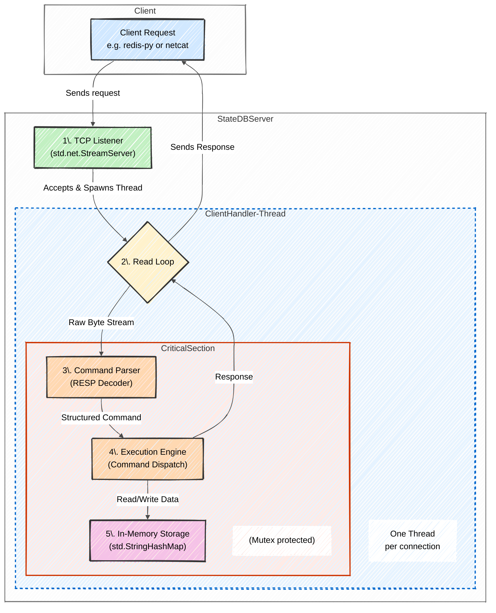

# StateDB: A High-Performance, In-Memory, Redis-like Database in Zig

## Project Overview and Goals

StateDB is an in-memory, key-value database built from the ground up in Zig. It aims to be functionally similar to established databases like Redis while serving as a deep, practical exploration into modern systems programming.

The core hypothesis is that **Zig provides a superior balance of performance, simplicity, and safety for developing high-performance network services** compared to alternatives like C/C++ (which often lack memory safety) and Rust (which has a steeper learning curve).

### Key Objectives:
* **Implement a Minimalist, High-Performance Server:** Design and build a lean, low-latency database server leveraging Zig's direct control over memory and its compile-time features.
* **Develop a Robust RESP Parser:** Create a parser for a significant subset of Redis-compatible commands, using Zig's strong type system and explicit error handling to ensure safety and correctness.
* **Master Low-Level Systems Programming:** Gain practical experience with manual memory management, using different allocators (e.g., `ArenaAllocator` for request-scoped allocations) to optimize performance and prevent memory fragmentation.
* **Utilize the Zig Ecosystem:** Become proficient with Zig's standard library for networking (`std.net`) and I/O, and master the Zig Build System for dependency management and cross-compilation.
* **Create a Testable and Benchmarkable System:** Establish a clear testing protocol to measure key performance indicators like requests per second (RPS), latency, and memory footprint.

## System Design



## Technology Stack

| Category | Technology | Description |
| :--- | :--- | :--- |
| **Core Language** | **Zig (v0.14.0+)** | Chosen for its simplicity, performance, explicit memory management, and powerful C interoperability. |
| **Protocols** | TCP/IP, RESP | The server communicates over TCP and implements the Redis Serialization Protocol (RESP). |
| **Libraries** | Zig Standard Library | Used for networking, I/O, memory management, and the built-in test runner. |
| | `zig-clap` | A third-party library for parsing command-line arguments, managed via Git submodules. |
| **Build System** | Zig Build System | Used to manage compilation, testing, dependencies, and cross-compilation to other platforms. |
| **CI/CD** | GitHub Actions | Configured to automate building and testing across multiple platforms (Windows, macOS, Linux). |
| **Testing** | `pytest`, `redis-py` | A comprehensive Python test suite for high-level compatibility and low-level protocol validation. |
| | `ncat`, `telnet` | Used for manual end-to-end testing and ad-hoc validation. |
| | `redis-benchmark` | The standard Redis tool used to measure performance metrics. |

## Dependency Management: Using Git Submodules

This project uses `zig-clap` for command-line argument parsing. We use **Git submodules** to vendor this dependency directly into our repository, giving us precise control over the code.

### Submodule Setup

If you are cloning this repository for the first time, you need to initialize the submodules:
```bash
git submodule update --init --recursive
````

## Building and Running

You can build, run, and test the project using the standard Zig build system.

### Build the Executable

This command compiles the project and places the executable in `zig-out/bin/statedb`.

```bash
zig build
```

### Run the Server

This command builds and immediately runs the server. By default, it listens on `localhost:8080`.

```bash
zig build run
```

### Run Unit Tests

This command compiles and runs all the tests defined within the Zig source files.

```bash
zig build test
```

## Continuous Integration & Release (CI/CD)

This project uses **GitHub Actions** to automate the build, test, and release process. The workflow is defined in `.github/workflows/release.yml`.

### Automated Workflow Steps:

1.  **Trigger:** The workflow is automatically triggered on every push to the `main` branch.
2.  **Build Matrix:** It uses a build matrix to compile and test the project in parallel across multiple target platforms:
      * `x86_64-windows`
      * `x86_64-linux`
      * `x86_64-macos`
      * `aarch64-macos` (Apple Silicon)
3.  **Create Release:** If all builds and tests succeed, the workflow automatically creates a new GitHub Release.
4.  **Publish Artifacts:** The compiled binaries for all target platforms are compressed and uploaded to the release as downloadable artifacts, making it easy to access the latest version for any OS.

## Testing the Server

Once the server is running, you can connect to it in several ways.

### 1\. Manual Testing with `ncat`

You can connect from another terminal using a tool like `ncat` or `telnet`.

```bash
ncat localhost 8080
```

### 2\. Automated Testing with Python

The project includes a comprehensive test suite written in Python to verify command correctness and compatibility.

  * **`test.py`**: This script uses `pytest` to run a full suite of automated tests using both raw sockets and the `redis-py` client.
    ```bash
    # Install dependencies
    pip install pytest redis

    # Run the test suite
    pytest -v test.py
    ```
  * **Jupyter Notebooks**: For interactive testing, two notebooks are provided in the `/notebooks` directory.
      * **[redis-py-testing.ipynb](notebooks/redis-py-testing.ipynb)**: An interactive notebook for testing the server using the high-level `redis-py` client.
      * **[raw-socket-testing.ipynb](notebooks/raw-socket-testing.ipynb)**: An interactive notebook for sending raw RESP commands to test the server's protocol parser directly.

## Implemented Commands

This table tracks the implementation status of Redis commands.

| Category | Command | Status |
| :--- | :--- | :--- |
| **Connection** | `PING` | [x] |
| | `ECHO` | [x] |
| | `CLIENT` | [x] |
| **Keys** | `DEL` | [x] |
| | `EXISTS` | [x] |
| | `FLUSHDB` | [x] |
| | `TYPE` | [x] |
| **Strings** | `GET` | [x] |
| | `SET` | [x] |
| | `GETDEL` | [x] |
| | `INCR` | [x] |
| | `DECR` | [x] |
| | `INCRBY` | [x] |
| | `DECRBY` | [x] |
| **Hashes** | `HSET` | [x] |
| | `HGET` | [x] |
| | `HGETALL` | [x] |

## Roadmap

### Current Implementation
✅ **Completed Features**:
- Thread-per-connection model with mutex protection
- Full RESP2 protocol support
- Core commands (SET/GET/HSET/HGET)
- Python FFI prototype
- CI/CD pipeline (multi-platform builds)

### Potential Future Directions
🔍 **Areas for Exploration** (when time/interest permits):
- Async I/O improvements
- RESP3 protocol support
- Basic persistence options
- Additional data structures
- Security enhancements

**Note**: These are not committed timelines but technical directions that could improve StateDB. Community contributions are especially welcome in these areas!

### How to Contribute
🌱 **Good First Issues**: [Explore beginner-friendly tasks](https://github.com/namitkewat/statedb/issues)

💡 **Suggested Focus Areas**:
- Protocol implementations
- Performance optimizations
- Client libraries
- Documentation improvements

## Project Status

This project is being developed as part of the final semester (Semester 4) project work for the **Master of Computer Applications (MCA)** program at **Manipal University Jaipur**.

It has a functional TCP server that can parse and handle a core set of Redis commands. The focus is on expanding the command set, ensuring correctness, and improving performance.
